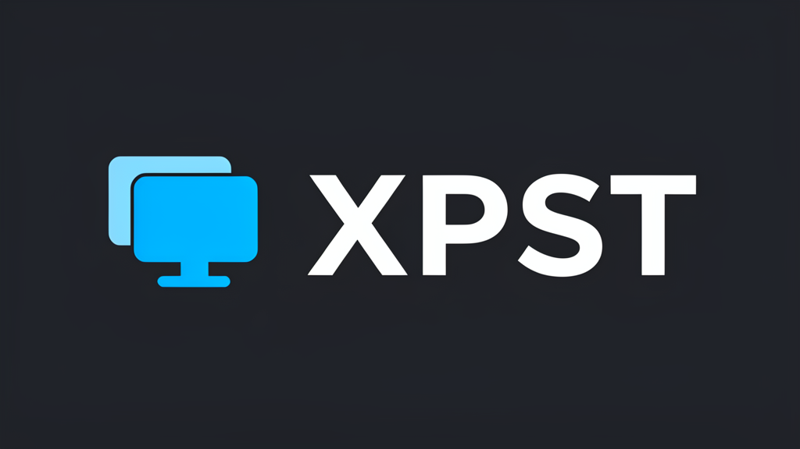

<p align="center">
  
</p>

# xPST

**Cross-Platform Studio — Enterprise-grade, free, local cross-posting for short-form video**

---


---

xPST is a local-first, open-source tool that automatically distributes short-form video across YouTube Shorts, Instagram Reels, X/Twitter, and TikTok. It downloads from any source, encodes with platform-specific optimizations, uploads with anti-bot protection, and tracks everything — all without your content ever leaving your machine. No subscriptions, no cloud servers, no vendor lock-in. Just run `xpst watch` and let it handle the rest.

---

## Features

- **Free forever** — no subscriptions, no per-channel fees, no premium tiers
- **100% local** — your content and credentials never leave your machine
- **Platform-specific encoding** — optimized FFmpeg profiles per target (1080p for YouTube/X, 720p for Instagram, VP9 tier upscaling)
- **Bidirectional cross-posting** — monitor ALL platforms, not just one source
- **Anti-bot protection** — random delays, time-of-day awareness, caption variation, User-Agent rotation
- **Circuit breaker pattern** — auto-disables failing platforms, recovers automatically
- **Crash recovery** — checkpoints resume half-uploaded videos after interruptions
- **Graceful degradation** — one platform failure never blocks the others
- **Rate limiting** — configurable per-platform daily limits (default: 5/day)
- **Carousel support** — Instagram albums, X threads, stitched video for YouTube/TikTok
- **Web dashboard** — real-time analytics, upload history, platform health at a glance
- **Webhook notifications** — Discord and Telegram alerts on success or failure
- **Unified analytics** — views, likes, comments, and shares across all platforms
- **Graceful shutdown** — handles SIGINT/SIGTERM cleanly, never corrupts state
- **Atomic state writes** — crash-safe JSON state with atomic file operations
- **Mac sleep/wake recovery** — catch-up logic compensates for laptop lid closures

---

## Supported Platforms

- **YouTube Shorts** — via official YouTube Data API v3 (OAuth 2.0)
- **Instagram Reels** — via instagrapi (browser session cookies)
- **X/Twitter** — via twikit (browser cookies)
- **TikTok** — via yt-dlp (browser cookies, optional)

---

## Quick Start

### 1. Install (3 commands)

```bash
# From PyPI (when published)
pip install xpst
xpst setup
xpst run

# Or from source (development)
git clone https://github.com/TysAIs/xPST.git
cd ~/XPST
pip install -e .
xpst setup
xpst run
```

### 2. Configure

```bash
xpst setup
```

The interactive wizard walks you through connecting each platform. Alternatively, create `~/.xpst/config.yaml` manually (see [Configuration](#configuration)).

### 3. Run

```bash
# One-shot: check for new videos and post
xpst run

# Continuous: watch for new videos every 15 minutes
xpst watch
```

---

## CLI Commands

xPST provides 21 commands for complete control over your cross-posting workflow.

### Setup and Maintenance

```bash
# Interactive first-time setup wizard
xpst setup

# Connect a specific platform (or all)
xpst connect
xpst connect youtube
xpst connect instagram --test

# Update all dependencies to latest versions
xpst update
xpst update --check

# Show version and all dependency versions
xpst version
```

### Core Operations

```bash
# Check for new videos and cross-post them
xpst run

# Bidirectional mode: check ALL sources, not just TikTok
xpst run --bidirectional

# Watch mode: continuous monitoring (default: every 15 minutes)
xpst watch

# Watch with custom interval (in seconds)
xpst watch --interval 600

# Watch in bidirectional mode
xpst watch --bidirectional

# Manually post a video to all platforms
xpst post --video ./my_video.mp4 --caption "Check this out!"

# Post to specific platforms only
xpst post --video ./my_video.mp4 --caption "Hello!" --platforms youtube,instagram

# Post a carousel (multiple files)
xpst post --video ./img1.jpg --video ./img2.jpg --video ./img3.jpg --caption "Album post"
```

### Monitoring and Diagnostics

```bash
# Test connectivity to all platforms (no uploads)
xpst health

# Show health status, statistics, and quota usage
xpst status

# View recent log output
xpst logs

# Show cross-platform analytics summary
xpst analytics

# Refresh analytics (ignore cache)
xpst analytics --refresh --platforms youtube,instagram

# Launch the native desktop app (recommended)
xpst app

# Or launch in browser
xpst dashboard
xpst dashboard --port 9090
```

### Authentication

```bash
# Authenticate with a specific platform
xpst auth youtube
xpst auth x
xpst auth instagram
xpst auth tiktok

# Show authentication and quota status for all platforms
xpst auth status
```

### Recovery and Deletion

```bash
# Retry failed or incomplete posts
xpst backfill
xpst backfill --platforms youtube --limit 5

# Delete a posted video from platforms
xpst delete <video_id>
xpst delete <video_id> --platform instagram
xpst delete <video_id> --yes
```

### Global Options

```bash
# Specify a custom config file
xpst --config /path/to/config.yaml run

# Enable verbose/debug logging
xpst --verbose run
```

---

## For AI Agents

xPST is designed for programmatic use by AI assistants, scripts, and automation tools.

### MCP Server (Recommended)

The built-in [MCP server](docs/MCP_TOOLS.md) exposes all xPST capabilities as tools and resources:

```bash
# Start the MCP server (stdio transport)
xpst-mcp

# Or via CLI
xpst mcp
```

**8 tools available:** `post_video`, `crosspost_new`, `check_status`, `list_platforms`, `get_analytics`, `delete_post`, `health_check`, `get_logs`

**3 resources:** `xpst://config`, `xpst://state`, `xpst://health`

See the full [MCP Tools Reference](docs/MCP_TOOLS.md) for schemas, parameters, and examples.

### CLI `--json` Flag

Every CLI command supports `--json` for machine-readable output:

```bash
xpst status --json       # Health status as JSON
xpst run --json           # Cross-posting results as JSON
xpst health --json        # Platform connectivity as JSON
xpst analytics --json     # Analytics summary as JSON
xpst version --json       # Version info as JSON
```

JSON mode is also auto-enabled when stdout is not a TTY (e.g., piped to another program).

See the full [Agent Guide](docs/AGENT_GUIDE.md) for all commands, output formats, and Python API usage.

---

## Dashboard

Launch the native desktop app (appears in your dock):

```bash
xpst app
```

Or launch in your browser:

```bash
xpst dashboard
```

This opens a local web server at `http://localhost:8080` (configurable with `--port`). The dashboard provides:

- **Upload history** — every post across all platforms with timestamps
- **Platform health** — live status of each connected account
- **Analytics** — views, likes, comments, and shares per post
- **Quota tracking** — daily upload usage per platform
- **Dead letter queue** — failed posts with error details and retry options

### Screenshots

**Overview Dashboard**


**Content Library**


**Analytics**


**Settings — Rate Limits**

- **Rate limit visibility** — how close you are to daily limits

The dashboard requires no external services — it reads from the same local state files as the CLI.

---

## Architecture

```
                    +------------------+
                    |     SOURCES      |
                    +------------------+
                    | TikTok (yt-dlp)  |
                    | Local filesystem |
                    +--------+---------+
                             |
                             v
                    +------------------+
                    |   SOURCE SERVICE  |
                    | (fetch, filter,  |
                    |  deduplicate)    |
                    +--------+---------+
                             |
                             v
+--------------------------------------------------+
|                  CROSS-POST ENGINE                |
|                                                    |
|  +-------------+  +----------------+  +---------+ |
|  | Video Proc  |  | Upload Service |  | State   | |
|  | (FFmpeg     |  | (per-platform  |  | Manager | |
|  |  encode)    |  |  encoding +    |  | (JSON)  | |
|  +-------------+  |  upload)       |  +---------+ |
|                    +-------+--------+              |
|  +-------------+          |         +-----------+  |
|  | Circuit     |          |         | Crash     |  |
|  | Breakers    |          |         | Recovery  |  |
|  +-------------+          |         +-----------+  |
|  +-------------+          |         +-----------+  |
|  | Anti-Bot    |          |         | Quota     |  |
|  | Protection  |          |         | Manager   |  |
|  +-------------+          |         +-----------+  |
+----------------------------|---------------------- -+
                             |
                             v
                    +------------------+
                    |    PLATFORMS     |
                    +------------------+
                    | YouTube Shorts   |
                    | Instagram Reels  |
                    | X/Twitter        |
                    +--------+---------+
                             |
                             v
                    +------------------+
                    |  NOTIFICATIONS   |
                    +------------------+
                    | Discord Webhook  |
                    | Telegram Bot     |
                    +------------------+
```

**Pipeline per video:** Fetch metadata -> Download source -> Encode per-platform (FFmpeg) -> Upload -> Track state -> Notify

**Reliability layers:** Circuit breakers disable failing platforms automatically. Exponential backoff retries transient failures. Crash recovery resumes from checkpoints. Quota manager prevents API limit violations.

---

## Configuration

xPST loads configuration from `~/.xpst/config.yaml` with environment variable overrides (`XPST_*` prefix). Priority: environment variables > config file > defaults.

```yaml
# ~/.xpst/config.yaml

accounts:
  tiktok:
    username: "your_tiktok_username"
    cookies_from_browser: true    # Use browser cookies for HD downloads
    # cookies_file: "~/.xpst/credentials/tiktok_cookies.json"

  youtube:
    enabled: true
    client_secrets: "~/.xpst/credentials/youtube_client_secrets.json"
    token_file: "~/.xpst/credentials/youtube_token.json"

  x:
    enabled: true
    cookies_file: "~/.xpst/credentials/x_cookies.json"

  instagram:
    enabled: true
    session_file: "~/.xpst/credentials/instagram_session.json"
    username: "your_instagram_username"

video:
  download_dir: "~/.xpst/downloads"
  cleanup_after_post: false
  encoding:
    youtube:
      resolution: 1080
      bitrate: "8M"
      maxrate: "10M"
      profile: "high"
      fps: 30
    instagram:
      resolution: 720
      crf: 23
      maxrate: "3500k"
      profile: "main"
      fps: 30
    x:
      resolution: 1080
      bitrate: "10M"
      maxrate: "12M"
      profile: "high"
      fps: 30

rate_limits:
  youtube: 5       # Max uploads per day
  instagram: 5
  x: 5
  tiktok: 5

schedule:
  check_interval: 900      # 15 minutes between checks
  catchup_window: 172800   # 48 hours lookback for missed videos

reliability:
  max_retries: 3
  retry_backoff: 2         # Exponential: 1s, 2s, 4s
  circuit_breaker_threshold: 5
  circuit_breaker_reset: 3600

monitoring:
  log_level: "INFO"
  log_file: "~/.xpst/logs/xpst.log"
  log_rotation: "10 MB"
  dashboard_username: ""   # Optional dashboard auth
  dashboard_password: ""

notifications:
  enabled: false
  on_success: true
  on_failure: true
  discord:
    webhook_url: ""
  telegram:
    bot_token: ""
    chat_id: ""
```

### Environment Variable Overrides

Every config value can be overridden with an environment variable using the `XPST_` prefix:

```bash
export XPST_TIKTOK_USERNAME="myusername"
export XPST_YOUTUBE_ENABLED="true"
export XPST_RATE_LIMITS_YOUTUBE="10"
```

---

## Security

xPST takes a **local-first, zero-trust** approach to security:

- **OS keychain storage** — credentials are stored in your operating system's secure keychain (macOS Keychain, Linux Secret Service, Windows Credential Manager). If the keychain is unavailable, xPST falls back to local JSON files protected by OS filesystem permissions.
- **No passwords in config** — the config file references credential paths, never stores secrets directly.
- **No cloud servers** — your content, credentials, and state never leave your machine. There is no xPST cloud service.
- **No third-party OAuth sharing** — Instagram and X use your own browser cookies. Only YouTube uses a standard OAuth 2.0 flow (your own Google Cloud project).
- **Atomic state writes** — state files are written atomically (write-then-rename) to prevent corruption.
- **Pidfile locking** — prevents concurrent instances from corrupting shared state.

See [Security Policy](SECURITY.md), [Privacy](docs/PRIVACY.md), and [Enterprise Readiness](docs/ENTERPRISE_READINESS.md) for the release/security posture.

### Authentication Methods

- **YouTube** — OAuth 2.0 via Google Cloud Console (free, your own project)
- **Instagram** — Browser session cookies via instagrapi
- **X/Twitter** — Browser cookies via twikit
- **TikTok** — Browser cookies via yt-dlp (optional, for HD quality)

---

## Anti-Bot Protection

xPST includes built-in protections to minimize the risk of platform bans:

- **Randomized delays** — jittered intervals between uploads mimic human behavior
- **Time-of-day awareness** — respects typical posting hours, avoids suspicious off-activity patterns
- **Caption variation** — adds subtle variation to captions to avoid duplicate content detection
- **User-Agent rotation** — rotates browser User-Agent strings across requests
- **Randomized platform order** — upload order varies per run to avoid predictable patterns
- **Conservative defaults** — 5 uploads/day per platform out of the box

**Important:** No automation tool can guarantee you won't be flagged. xPST minimizes risk through conservative defaults and human-like behavior patterns, but use at your own discretion. Start with the default rate limits and increase gradually.

---

## Rate Limits

xPST enforces configurable per-platform daily upload limits:

- **Default:** 5 uploads/day per platform (20 total across all platforms)
- **Configurable:** set per-platform limits in `config.yaml` or via the dashboard
- **Tracked persistently:** daily counts survive restarts and crashes
- **Quota-aware:** separate from API quotas (e.g., YouTube Data API has its own daily limit)

```yaml
# Example: more aggressive limits
rate_limits:
  youtube: 10
  instagram: 8
  x: 12
  tiktok: 5
```

When a limit is reached, remaining videos are queued and automatically picked up the next day.

---

## Bidirectional Cross-Posting

Most cross-posting tools work in one direction: pick one source platform, post to the rest. xPST supports **bidirectional cross-posting** — it monitors ALL connected platforms for new content and distributes in every direction.

**How it works:**

```bash
# Standard mode: TikTok -> YouTube, Instagram, X
xpst run

# Bidirectional mode: ALL sources -> ALL targets
xpst run --bidirectional
```

In bidirectional mode:

- Post a Reel on Instagram -> automatically goes to YouTube Shorts, X, TikTok
- Upload a Short on YouTube -> automatically goes to Instagram Reels, X, TikTok
- Post a video on X -> automatically goes to YouTube Shorts, Instagram Reels, TikTok

The engine deduplicates across platforms so content is never double-posted. Each platform acts as both a source and a destination.

---

## Contributing

Contributions are welcome. Here's how to get started:

```bash
# Clone the repository
git clone https://github.com/TysAIs/xPST.git
cd ~/XPST

# Create a virtual environment
python3 -m venv .venv
source .venv/bin/activate

# Install in development mode
pip install -e ".[dev]"

# Run the test suite
pytest

# Run with coverage
pytest --cov=xpst --cov-report=term-missing
```

### Guidelines

- **Tests required** — all new features must include tests. The suite has 802 collected tests; keep it green.
- **Type hints** — use Python 3.10+ type hints throughout.
- **Docstrings** — Google-style docstrings for all public functions and classes.
- **No new dependencies** — discuss in an issue before adding dependencies.
- **Commit messages** — use conventional commits (`feat:`, `fix:`, `docs:`, `test:`).

### Project Structure

```
xPST/
  src/xpst/
    cli.py              # CLI interface (Click)
    config.py           # Configuration management
    engine.py           # Core cross-posting engine
    state.py            # Persistent state management
    scheduler.py        # Watch mode scheduling
    anti_bot.py         # Anti-bot protection
    crash_recovery.py   # Checkpoint-based crash recovery
    platforms/          # Platform uploaders (youtube, instagram, x)
    sources/            # Content sources (tiktok, local)
    services/           # Upload and source services
    utils/              # Credentials, logging, quotas, video processing
    dashboard/          # Web dashboard (NiceGUI)
  tests/                # Test suite (802 collected tests)
  docs/                 # Documentation
```

---

## License

Licensed under either of:

- **MIT License** ([LICENSE](LICENSE))
- **Apache License 2.0** ([LICENSE](LICENSE))

at your option. You may use this software under the terms of either license.

---

## Acknowledgments

xPST stands on the shoulders of these excellent open-source projects:

- **[yt-dlp](https://github.com/yt-dlp/yt-dlp)** — video downloading from TikTok and other platforms
- **[instagrapi](https://github.com/subzeroid/instagrapi)** — Instagram API client for Reels uploads
- **[twikit](https://github.com/david-lev/twikit)** — X/Twitter API client for video uploads
- **[google-api-python-client](https://github.com/googleapis/google-api-python-client)** — YouTube Data API v3 client
- **[NiceGUI](https://github.com/zauberzeug/nicegui)** — web dashboard framework
- **[Click](https://github.com/pallets/click)** — CLI framework
- **[Rich](https://github.com/Textualize/rich)** — terminal formatting and tables
- **[FFmpeg](https://ffmpeg.org)** — video encoding and processing
