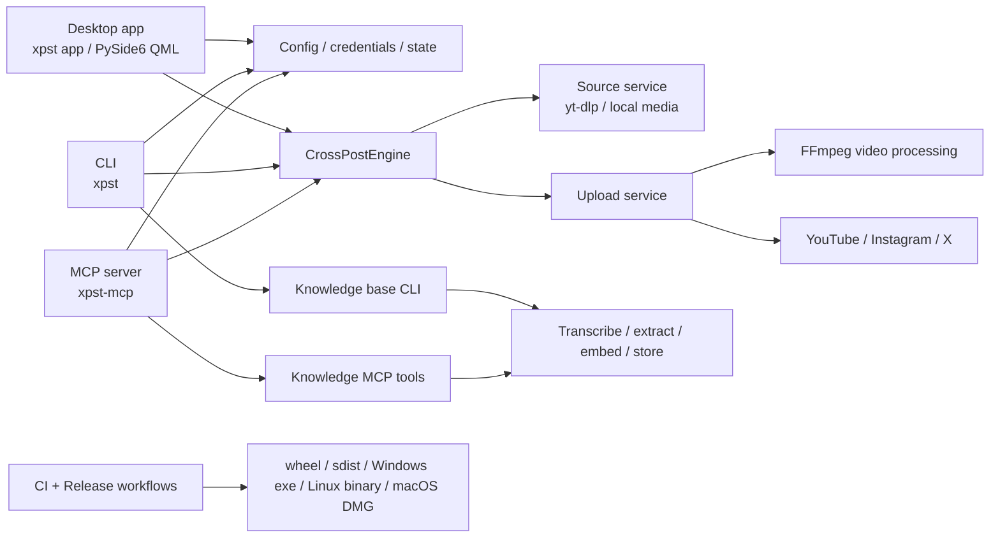

# xPST Ship Readiness Final Report

Status date: 2026-06-14
RC tag: `v0.1.0-rc2`
Release URL: https://github.com/TysAIs/xPST/releases/tag/v0.1.0-rc2

## Executive Decision

xPST is ready as an RC2 release candidate for technical validation across the app, CLI, MCP server, knowledge-base surfaces, package artifacts, and desktop bundles. The RC2 GitHub Release completed successfully and is marked as a prerelease.

xPST is not yet fully public-launch complete in the sense of "everything works flawlessly for real users on real accounts." The remaining blockers are external/owner-gated: live posting proof on owner accounts, signing/notarization decisions, and a real Windows installer/taskbar-pinning story.

Go/no-go:
- RC2 release candidate: GO.
- Public stable `v0.1.0`: NO-GO until owner-gated live platform and signing/install checks are complete.

## System Map

## What Was Merged

- B1 checksum aggregation fix.
- B2 prerelease release behavior.
- B3 FFmpeg missing-path guard.
- B4 desktop Schedule New flow.
- NB7 knowledge-base JSON output behavior.
- NB8 centralized config-dir behavior.
- NB6 README/install documentation.
- App/CLI/MCP hardening from PR #8.
- PR #11 test isolation for the FFmpeg guard.
- PR #12 package/runtime version alignment for `v0.1.0-rc2`.
- PR #13 Windows executable smoke cleanup-lock fix.

## Release Evidence

GitHub Actions:
- Main CI after PR #13: success.
- RC2 release workflow: success.
- Release run: https://github.com/TysAIs/xPST/actions/runs/27496707190

RC2 release assets:
- Python: `xpst-0.1.0rc2-py3-none-any.whl`, `xpst-0.1.0rc2.tar.gz`.
- Desktop: `xPST.exe`, `xPST` Linux binary, `xPST.dmg`.
- Evidence/SBOM/notes: platform release evidence JSON, SBOM JSON, release notes, licensing files.
- Checksums: `SHA256SUMS`, `SHA512SUMS`.

Checksum coverage check:
- 26 total release assets.
- 24 non-checksum assets.
- `SHA256SUMS` entries: 24.
- `SHA512SUMS` entries: 24.
- Missing checksum entries: 0.

## Verification Summary

Local gates run during RC2 preparation:
- Full test suite: `1398 passed, 23 skipped`.
- Ruff: passed.
- Mypy: passed.
- Import-linter contracts: `2 kept, 0 broken`.
- Pip audit: no known vulnerabilities found; local project package skipped because it is not on PyPI.
- Public safety scan: no findings.
- Build: wheel and sdist built as `0.1.0rc2`.
- Clean install smoke: passed for wheel and sdist, including installed `xpst-mcp` stdio KB query.
- Desktop package static verification: passed.
- QML page smoke: passed.
- Desktop app launch smoke on this Windows workstation: passed.
- GitHub Docker smoke: passed.

## Readiness By Surface

| Surface | Status | Evidence | Remaining gap |
| --- | --- | --- | --- |
| CLI | RC-ready | CLI tests, clean install smoke, `xpst --version` reports `0.1.0rc2` | Local global PATH is not configured on this workstation unless using `.venv` or release install |
| MCP | RC-ready | Installed `xpst-mcp` stdio KB query smoke, MCP tests | Mutating-tool guardrail smoke should be expanded |
| Desktop app | RC-ready as portable app | QML smoke, package checks, Windows/Linux/macOS release jobs, Windows exe smoke fixed | No real Windows installer/taskbar-pinning flow yet |
| Autoposter | Internally ready, live proof pending | Engine/provider/preflight/dedupe/quota tests, live smoke helper | Real owner-account upload/delete evidence required |
| Knowledge base | RC-ready optional subsystem | CLI/MCP KB tests, lazy import wall, clean install MCP KB query | Heavy optional deps and real model/vector behavior remain environment-dependent |
| Release | RC-ready | RC2 release workflow succeeded, prerelease flag true, checksums complete | Stable public release still needs signing/notarization/live evidence |

## What Does Not Fully Work Yet

1. Windows is not a polished installed app yet.
   The release ships a portable `xPST.exe`. There is no real installer, uninstall flow, Start Menu/taskbar pin guarantee, or installer smoke test. A manual Start Menu shortcut was created locally on this workstation, but that is not a shipped installer feature.

2. Live autoposting is not proven end to end.
   Tests prove orchestration and safety behavior. They do not prove real posting to YouTube, Instagram, or X on owner accounts. Instagram and X use unofficial/session-cookie client paths and can be challenged or broken by platform changes.

3. Public stable release requirements are still owner-gated.
   Windows signing, macOS Developer ID signing/notarization, PyPI trusted publishing, and live platform evidence require owner credentials/secrets.

4. GitHub Actions has upcoming Node 20 deprecation warnings.
   Current workflows pass, but actions should be upgraded before the GitHub runner default changes become disruptive.

## Owner-Gated Checklist

Before stable public `v0.1.0`:

1. Run live platform health evidence:
   `python scripts/verify_live_platforms.py --require --json > release/live-platforms.json`

2. Run public preflight with evidence:
   `python scripts/release_preflight.py --public --live-evidence release/live-platforms.json --json`

3. Perform one owner-approved private/unlisted test upload per enabled platform where possible.

4. Verify returned post IDs/URLs, media quality, caption, and cleanup/delete behavior.

5. Decide Windows distribution:
   portable exe only, or real installer/MSIX/WiX/Inno with shortcuts and uninstall.

6. Complete signing:
   Windows Authenticode cert, macOS Developer ID, Apple notarization credentials.

7. Download RC2 assets from GitHub and run manual Windows/macOS smoke from Explorer/Finder.

## Next Engineering Queue

Critical:
- Add a real Windows installer or explicitly document portable-only distribution.
- Add installer/shortcut/AppUserModelID smoke if installer path is chosen.
- Add installed MCP mutating-tool guardrail smoke.
- Add owner-account live post smoke evidence.

Important:
- Update GitHub Actions dependencies for Node 24 readiness.
- Extend `verify_desktop_package.py` to include `build_linux.spec`.
- Add public release evidence summary with redacted live-account details.

Post-RC:
- More desktop UI/accessibility polish.
- Package optional `xpst[knowledge]` installability smoke for heavier KB extras.
- Move signing/PyPI from owner-gated to routine automation when secrets are stable.
